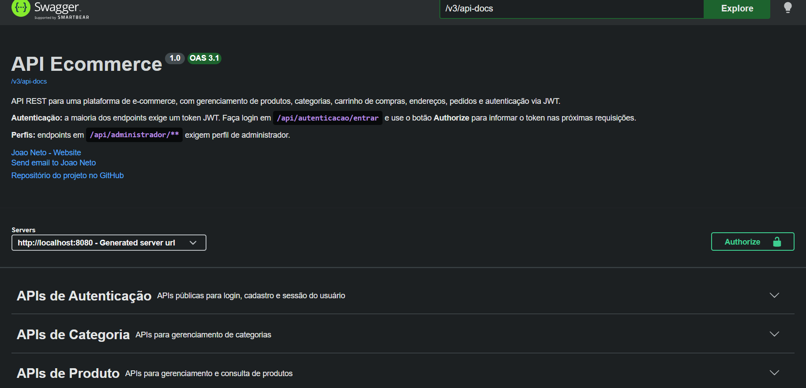
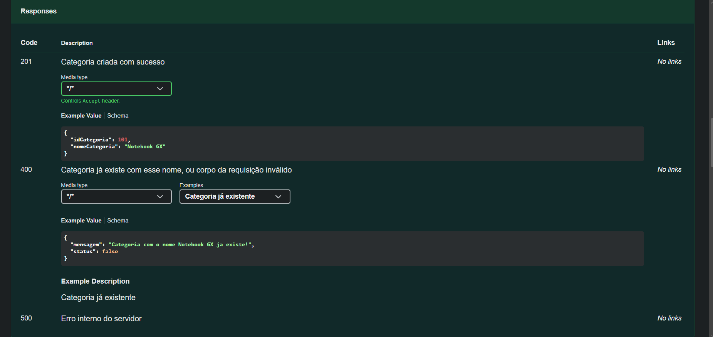
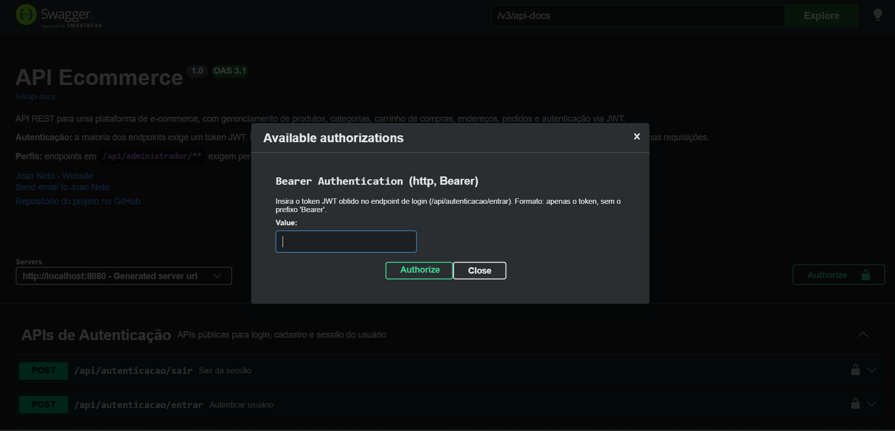
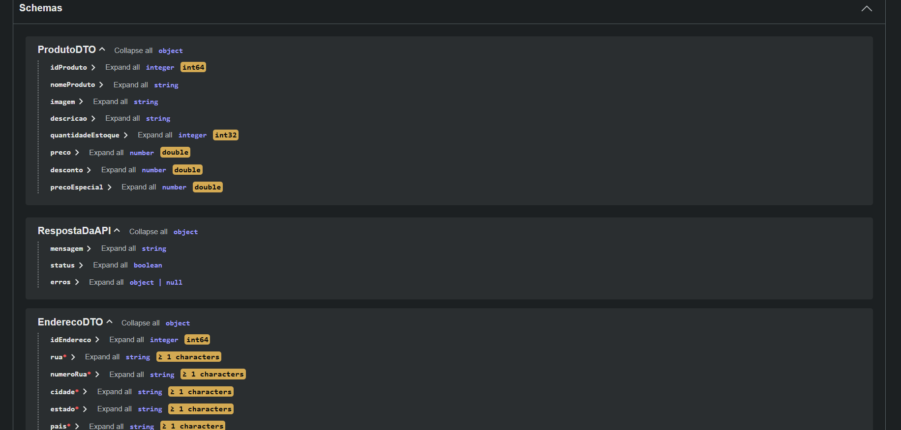

# 🛒 E-commerce API

API REST completa para gerenciamento de uma plataforma de e-commerce, desenvolvida em **Java 21** com **Spring Boot 3**. O projeto simula um ambiente real de loja virtual: catálogo de produtos e categorias, autenticação e autorização via JWT, carrinho de compras, endereços de entrega e fechamento de pedidos.

Criado com foco em aplicar, na prática, padrões usados em back-ends profissionais: arquitetura em camadas, DTOs, tratamento global de exceções, paginação, segurança com Spring Security + JWT e documentação de API com OpenAPI/Swagger.

---

## 📸 Documentação Interativa (Swagger UI)

A API é totalmente documentada com Swagger/OpenAPI 3.1 — todos os endpoints, exemplos de request/response e mensagens de erro reais estão disponíveis em `/swagger-ui/index.html`.









---

## 🚀 Tecnologias Utilizadas

- **Java 21**
- **Spring Boot 3.5**
- Spring Web (REST)
- Spring Data JPA (Hibernate)
- Spring Security
- Bean Validation (Jakarta Validation)
- **JWT** (jjwt — autenticação via cookie ou header `Authorization: Bearer`)
- **PostgreSQL**
- **springdoc-openapi** (Swagger UI / OpenAPI 3.1)
- ModelMapper
- Lombok
- Maven
- Postman (testes manuais)

---

## 📂 Arquitetura do Projeto

O projeto segue arquitetura em camadas:

```
src/main/java/com/joaoneto/ecommerce
├── config           → Configurações gerais (Swagger, constantes da aplicação)
├── controllers      → Camada de entrada, recebe requisições HTTP
├── domain           → Entidades JPA
├── dtos             → Objetos de transferência de dados (DTOs)
├── exceptions       → Exceções customizadas e tratamento global
├── repositories     → Comunicação com o banco de dados (Spring Data JPA)
├── security
│   ├── config       → Configuração do Spring Security
│   ├── jwt          → Geração/validação de tokens JWT
│   ├── request      → DTOs de entrada (login, cadastro)
│   ├── response     → DTOs de saída de autenticação
│   └── services     → UserDetailsService e afins
├── services         → Regras de negócio da aplicação
├── util             → Classes utilitárias (ex: usuário autenticado atual)
└── EcommerceApplication
```

---

## ✅ Funcionalidades

### 🔐 Autenticação e Usuários
- Cadastro de usuário com perfis (usuário, vendedor, administrador)
- Login com geração de token JWT (cookie **e** header `Authorization: Bearer`)
- Logout
- Consulta de dados do usuário autenticado
- Autorização baseada em perfis (endpoints `/api/administrador/**` restritos)

### 📦 Categorias
- CRUD completo
- Paginação e ordenação
- Validação de nome único

### 🛍️ Produtos
- CRUD completo (criação restrita a administradores)
- Busca por categoria
- Busca por palavra-chave
- Upload de imagem do produto
- Paginação e ordenação
- Cálculo automático de preço com desconto

### 🛒 Carrinho de Compras
- Adicionar produto ao carrinho
- Atualizar quantidade (incrementar/decrementar)
- Remover produto do carrinho
- Consultar carrinho do usuário logado
- Validações de estoque disponível

### 📍 Endereços
- CRUD completo de endereços vinculados ao usuário autenticado
- Validação de campos obrigatórios

### 📑 Pedidos
- Finalização de compra a partir do carrinho
- Registro de pagamento (método, gateway, status)
- Congelamento do preço do produto no momento da compra

---

## ⚠️ Tratamento Global de Exceções

Implementado com `@RestControllerAdvice`, padronizando **todas** as respostas de erro da API em um único formato (`RespostaDaAPI`):

```json
{
  "mensagem": "Produto nao encontrado com idProduto: 501",
  "status": false,
  "erros": null
}
```

Para erros de validação de campos, o campo `erros` é preenchido com o mapa de campo → mensagem:

```json
{
  "mensagem": "Erro de validação",
  "status": false,
  "erros": {
    "nomeCategoria": "não deve estar em branco"
  }
}
```

Cenários tratados:
- Erros de validação (`@Valid` / Bean Validation)
- Recursos não encontrados (404)
- Regras de negócio violadas (400) — ex: estoque insuficiente, produto duplicado, carrinho vazio

---

## 🔍 Recursos da API

**Paginação**
```
GET /api/categorias?numeroPagina=0&tamanhoPagina=10
```

**Ordenação**
```
GET /api/categorias?ordenarPorCategoria=idCategoria&classificarOrdem=asc
```

**Busca por categoria**
```
GET /api/public/categorias/{idCategoria}/produtos
```

**Busca por palavra-chave**
```
GET /api/public/produtos/palavra-chave/{palavraChave}
```

**Upload de imagem**
```
PUT /api/produtos/{idProduto}/imagem
```
(multipart/form-data, campo `imagem`)

---

## 🛡️ Segurança

A API utiliza **Spring Security + JWT**. O token pode ser enviado de duas formas:

1. **Cookie** (definido automaticamente no login via navegador/Postman)
2. **Header** `Authorization: Bearer {token}` (usado pelo botão **Authorize** do Swagger UI)

Endpoints públicos (não exigem token): `/api/autenticacao/**`, `/api/public/**`.
Endpoints administrativos (`/api/administrador/**`) exigem perfil de administrador.

---

## 🗄️ Banco de Dados

O projeto está configurado para usar **PostgreSQL**:

```properties
spring.datasource.url=jdbc:postgresql://localhost:5432/ecommerce
spring.datasource.username=postgres
spring.datasource.password=${DB_PASSWORD:senha-padrao-dev}
spring.jpa.hibernate.ddl-auto=update
```

> O suporte a H2 (memória) e MySQL foi mantido comentado no `application.properties`, caso queira alternar o banco durante o desenvolvimento.

### Variáveis de ambiente

| Variável | Descrição | Obrigatória |
|---|---|---|
| `DB_PASSWORD` | Senha do banco PostgreSQL | Sim (produção) |
| `JWT_SECRET` | Chave secreta usada para assinar os tokens JWT | Sim (produção) |

---

## ▶️ Como Executar

### Pré-requisitos
- Java 21+
- Maven
- PostgreSQL rodando localmente (ou ajuste a `datasource.url`)

### Passos

```bash
git clone https://github.com/Joaoneto1011/ecommerce.git
cd ecommerce
```

Configure o banco de dados criando um banco `ecommerce` no PostgreSQL, e defina as variáveis de ambiente (ou use os valores padrão de desenvolvimento já presentes no `application.properties`).

```bash
./mvnw spring-boot:run
```

A aplicação sobe em `http://localhost:8080`.

### Acessando a documentação

```
http://localhost:8080/swagger-ui/index.html
```

---

## 📈 Próximas Implementações

- [ ] Frontend com React + JavaScript, consumindo esta API
- [ ] Testes unitários e de integração
- [ ] Docker / docker-compose
- [ ] Deploy em nuvem (AWS Elastic Beanstalk)
- [ ] Logs estruturados
- [ ] CI/CD

---

## 🎯 Objetivos do Projeto

- Aprender Spring Boot e Spring Security na prática
- Construir uma API REST profissional, documentada e segura
- Aplicar arquitetura em camadas e boas práticas de tratamento de erro
- Compor portfólio para oportunidades na área de backend

---

## 👨‍💻 Autor

**João Neto**
Estudante de Sistemas de Informação e desenvolvedor backend em formação.

- GitHub: [github.com/Joaoneto1011](https://github.com/Joaoneto1011)
- LinkedIn: [linkedin.com/in/joao-rodrigues-neto-855757293](https://www.linkedin.com/in/joao-rodrigues-neto-855757293/)
- Email: neto31510@gmail.com

---

## 📌 Status do Projeto

🚧 Em desenvolvimento ativo — novas funcionalidades sendo adicionadas continuamente.
